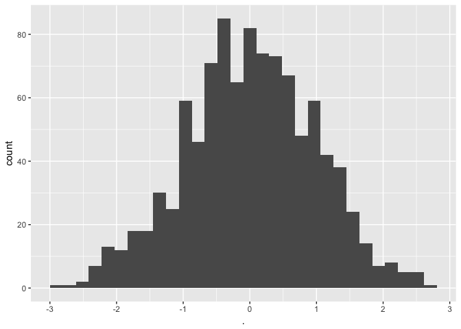

histplot.R
================
black
Fri Feb 9 13:30:39 2018

``` r
library(ggplot2)
library(magrittr)

x <- rnorm(1000)
x %>% as.data.frame() %>% 
  ggplot(., aes(x=.)) + geom_histogram()
```

    ## `stat_bin()` using `bins = 30`. Pick better value with `binwidth`.


